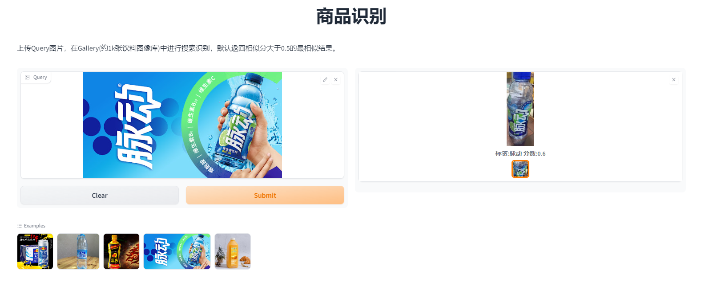

## 商品识别服务
基于pp-ShituV2搭建的商品识别服务可视化demo。服务端基于paddleserving运行，客户端基于gradio搭建，上传本地query图片，发送http请求获取搜索结果，在页面上展示。如图所示，



### 服务端部署
```
cd server
# 构建镜像
docker build -t server:v1.0 .
# 启动服务
docker run -d -p 18081:18081 server:v1.0
```


### 客户端部署
```
cd client
pip install gradio
# 启动服务
python app.py
```
浏览器输入 http://localhost:7860 打开可视化界面。
